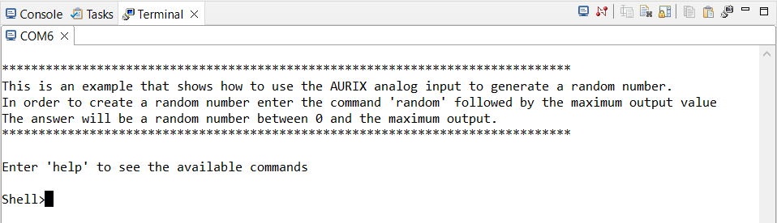
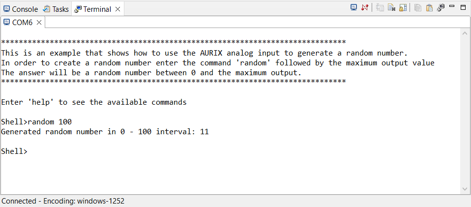

  

# iLLD_TC4D7_LK_ADS_ADC_Random_Number_Generator
**Create a random number in the 0 to 255 range using the Triggered Modular Analog to Digital Converter (TMADC) readings as generator**

## Device  
The device used in this example is AURIX&trade; TC4D7XP_A-Step_MC_COM

## Board  
The board used for testing is the AURIX&trade; TC4D7 lite Kit (KIT_A3G_TC4D7_LITE)  

## Scope of work
The Triggered Modular Analog to Digital Converter (TMADC) is used to read a value on channel 0.
The ASCLIN module is configured for UART communication. The Shell from Infineon low level drivers (iLLDs) exploits the Asynchronous/Synchronous Interface (ASCLIN) module to interpret and manage commands from the user like "info", "random" and "help" 
which have been developed and are easily expandable. Random command returns a random number between 0 and 255.
Using the TMADC to select the less significant bit of 8 consecutive readings of the analog channel separated by a predefined wait time helps improving the quality of the random number. The user restrict the range by predefining the value of n (e.g. random 10 will provide a random number between 0 and 10).

## Introduction  
- The *Asynchronous/Synchronous Interface* (ASCLIN) module provides serial communication with external devices. In this example it is used to interface the PC through the USB port via UART communication
- A *Shell* is a user interface for parsing commands and accessing devices
- The *Triggered Modular Analog-to-Digital Converter module* (TMADC) of the AURIX&trade; TC4xx provides a set of analog input channels using the Successive Approximation Register (SAR) principle

## Hardware setup  
This code example has been developed for the AURIX&trade; TC4D7 Lite Kit (KIT_A3G_TC4D7_LITE). 
In this example, the TMADC channel 0 analog input is used. 
The board should be connected to the PC via USB, in order to allow the UART connection. 

   

## Implementation  
**Configure the Project**  
This project needs two modules, one to configure the user interface via shell and one to configure the analog peripheral for reading.

**Configure the ASCLIN**  
The ASCLIN module is necessary to implement the serial communication with the terminal.

Configuration of the ASCLIN module for UART communication is done in the function `initSerialInterface()`, it takes the desired UART baudrate as parameter.  
The desired baudrate can be defined with the macro `UART_BAUDRATE`, whose default value is set to 115200 baud.

**Configuration of the TMADC module**  
Configuration of the TMADC module is done once in the setup phase by calling the initialization function `init_TMADC()`, which contains the following steps:
- TMADC module configuration
- TMADC channel configuration

**The conversion function**  
The `run_TMADC()` function reads the analog value from TMADC channel 0 and returns the result as a 16-bit signed value.

**The creation of the random number**  
Once the user inserts in the shell the string "random" followed by a number between 0 and 255, eight readings of the analog channel are performed with an interval of a few milliseconds between each read. The less significant bit of each read is taken, shifted to the left and added to the partial random number created.

## Compiling and programming
Before testing this code example:
- Power the board through the dedicated power connector
- Connect the board to the PC through the USB interface
- Build the project using the dedicated Build button  or by right-clicking the project name and selecting "Build Project"
- To flash the device and immediately run the program, click on the dedicated Flash button   

## Run and Test  
For this example, a serial terminal is required for visualizing the text. The terminal can be opened inside the AURIX&trade; Development Studio using the following icon:  

  

The serial terminal must be configured with the following parameters to enable the communication between the board and the PC:  
- Speed (baud): 115200
- Data bits: 8
- Stop bit: 1

After code compilation and flashing the device, check the opened terminal window on AURIX&trade; Development Studio, which looks like the following:  

  

Typing "random n" where n defines a range between 1 and 255 a random number between 0 and n will be generated:

## References  

AURIX&trade; Development Studio is available online:  
- <https://www.infineon.com/aurixdevelopmentstudio>  
- Use the "Import..." function to get access to more code examples  

More code examples can be found on the GIT repository:  
- <https://github.com/Infineon/AURIX_code_examples>  

For additional trainings, visit our webpage:  
- <https://www.infineon.com/aurix-expert-training>  

For questions and support, use the AURIX&trade; Forum:  
- <https://community.infineon.com/t5/AURIX/bd-p/AURIX>  
