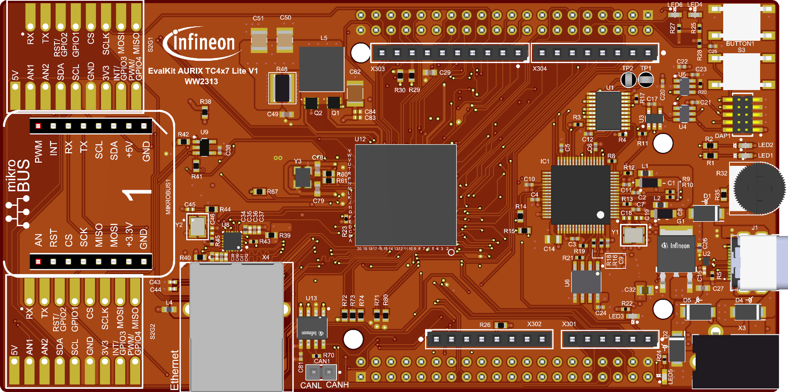

  

# iLLD_TC4D7_LK_ADS_TMADC_Master_Slave_EGTM_ATOM_Trig
**Example of TMADC Master/Slave configuration for synchronous sampling of multiple channels triggered by EGTM ATOM**  

## Device  
The device used in this example is AURIX&trade; TC4D7XP_A-Step_MC_COM.  

## Board  
The board used for testing is the AURIX&trade; TC4D7 Lite Kit (KIT_A3G_TC4D7_LITE).  

## Scope of work   
**To whom this example is useful?**  
When multiple ADC inputs are to be sampled simultaneously, then normally the same trigger signal is used. This example demonstrates the TMADC module configured with multiple channels sampling the analog input synchronously at the same time, triggered by an EGTM ATOM output signal.

With this example, three TMADC channels sample the analog input synchronously at the same time. All channels share the same trigger source from EGTM ATOM, ensuring synchronous conversion.

## Introduction  
**TMADC (Time-Multiplexed Analog-to-Digital Converter)**  
The Time-Multiplexed Analog-to-Digital Converter (TMADC) is based on a Successive Approximation Register (SAR) concept and provides 12-bit analog to digital conversion of up to 16 external analog input channels using 2 SAR cores supporting a maximum output sample-rate of 4 MSPS.

**EGTM ATOM Timers**  
The Enhanced Generic Timer Module (EGTM) is an enhanced instance of the Generic Timer Module (GTM), a universal timer architecture provided by Bosch AE. The ARU-connected Timer Output Module (ATOM), which is part of the EGTM, is able to generate complex output signals. The Clock Management Unit (CMU) is responsible for clock generation of the EGTM.  
In this example, the ATOM channel is used to produce the trigger signal for TMADC conversion.

## Hardware setup  
This code example has been developed for the board AURIX&trade; TC4D7 Lite Kit board (KIT_A3G_TC4D7_LITE):

  

## Implementation  

**Initialization of the TMADC**  
The purpose of this example is to show the TMADC channels configured for synchronous sampling with a shared trigger source from EGTM ATOM.
- TMADC Module 0, Channel 0 is configured as the master channel (Signal U)
- TMADC Module 0, Channel 1 is configured as a slave channel (Signal V)
- TMADC Module 0, Channel 2 is configured as a slave channel (Signal W)
- All 3 channels are configured with the same trigger source (Trigger 36 from EGTM ATOM0 CH3, falling edge)
- All channels use one-shot conversion mode with SAR Core 0
- A result interrupt (Service Request 0) is generated when all conversions complete
- Upon the interrupt, the results from each channel are read to global array *g_results[x]*, where x = 0: Signal U, x = 1: Signal V and x = 2: Signal W

The *initTMADC()* configuration sequence is the following:
* Enabling of the ADC Module
* Configuration of the TMADC Module 0
* Initialization of the TMADC driver
* Initialization of the TMADC service request configuration register 0
* Initialization of the TMADC channels (CH0, CH1, CH2)
* Run of the TMADC Module

Following TMADC characteristics are enabled/configured with this example:

<table>
    <tbody>
        <tr>
            <td><b>TMADC Module</b></td>
            <td>0</td>
        </tr>
        <tr>
            <td><b>TMADC event</b></td>
            <td>Service request on result event</td>
        </tr>
        <tr>
            <td><b>Interrupt provider</b></td>
            <td>TriCore&trade; Core 0</td>
        </tr>
        <tr>
            <td><b>TMADC service request</b></td>
            <td>Service request generation on occurrence of all events</td>
        </tr>
        <tr>
            <td><b>TMADC Channels</b></td>
            <td>
                <table>
                    <tbody>
                        <tr>
                            <td>CH0 (Master U), one-shot conversion, SAR Core0, Wait-for-Read enabled</td>
                        </tr>
                        <tr>
                            <td>CH1 (Slave V), one-shot conversion, SAR Core0, Wait-for-Read enabled</td>
                        </tr>
                        <tr>
                            <td>CH2 (Slave W), one-shot conversion, SAR Core0, Wait-for-Read enabled</td>
                        </tr>
                    </tbody>
                </table>
            </td>
        </tr>
        <tr>
            <td><b>Service request result node</b></td>
            <td>Service request 0, each channel</td>
        </tr>
        <tr>
            <td><b>Sampling time</b></td>
            <td>100ns, each channel</td>
        </tr>
        <tr>
            <td><b>TMADC Trigger Source</b></td>
            <td>
                <table>
                    <tbody>
                        <tr>
                            <td>Same for all channels</td>
                        </tr>
                        <tr>
                            <td>Trigger number 36 (EGTM ATOM)</td>
                        </tr>
                        <tr>
                            <td>Channel conversion request on falling edge</td>
                        </tr>
                    </tbody>
                </table>
            </td>
        </tr>
    </tbody>
</table>

**Initialization of the Trigger Signal (PWM)**  

The *IfxEgtm_Pwm.h* iLLDs provide the EGTM PWM driver to configure required peripheral resources and produce the trigger signal for TMADC. The *IfxEgtm_Trigger.h* iLLD provides the EGTM driver to connect trigger signal to TMADC.

The *initEgtmAtomTrig()* configuration sequence is the following:
* Initialization of the EGTM Module
* Configuration of the CMU-CLOCK0 for the ATOM usage
* Configuration of the PWM channel to produce trigger for TMADC
* Configuration of the TMADC trigger source (EGTM Cluster 0, ATOM Channel 3)
* Initialization of the drivers

Following PWM characteristics for TMADC trigger are enabled/configured with this example:

<table>
    <tbody>
        <tr>
            <td><b>PWM Type</b></td>
            <td>Edge Aligned</td>
        </tr>
        <tr>
            <td><b>Frequency</b></td>
            <td>20 kHz</td>
        </tr>
        <tr>
            <td><b>Polarity</b></td>
            <td>Duty-On Low</td>
        </tr>
        <tr>
            <td><b>Complementary Output</b></td>
            <td>Disabled</td>
        </tr>
        <tr>
            <td><b>DTM</b></td>
            <td>Disabled</td>
        </tr>
        <tr>
            <td><b>Duty cycle</b></td>
            <td>50% (TMADC trigger at the middle of the PWM period)</td>
        </tr>
    </tbody>
</table>

The table below provides the mapping between the signals and the Port Pins:  

<table>
    <tbody>
        <tr>
            <td><b>&emsp;Signal</b></td>
            <td><b>&emsp;Pin Mapping</b></td>
        </tr>
        <tr>
            <td>&emsp;ADC_TRIG_OUT</td>
            <td>&emsp;P33.0</td>
        </tr>
        <tr>
            <td>&emsp;INTERRUPT_OUT_U</td>
            <td>&emsp;P02.5</td>
        </tr>
        <tr>
            <td>&emsp;INTERRUPT_OUT_V</td>
            <td>&emsp;P02.6</td>
        </tr>
        <tr>
            <td>&emsp;INTERRUPT_OUT_W</td>
            <td>&emsp;P02.7</td>
        </tr>
    </tbody>
</table>

**The TMADC Interrupt Service Routine (ISR)**

The TMADC ISR implemented in this example updates *g_results[x]* variable with new TMADC result value by calling the iLLD function *IfxAdc_Tmadc_readChannelResult()* (iLLD source file *IfxAdc_Tmadc.c*).

## Compiling and programming

Before testing this code example:  
- Power the board through the dedicated power connector 
- Connect the board to the PC through the USB interface
- Build the project using the dedicated Build button  or by right-clicking the project name and selecting "Build Project"
- To flash the device and immediately run the program, click on the dedicated Flash button   

## Run and Test   

Connect the analog input channels (AN0, AN1, AN2) with known voltage sources.

After code compilation and flashing the device, perform the following:

Add the variable *g_results[x]* to the Watches on the debugger and monitor values while changing the voltage levels.

## References  

AURIX&trade; Development Studio is available online:  
- <https://www.infineon.com/aurixdevelopmentstudio>  
- Use the "Import..." function to get access to more code examples  

More code examples can be found on the GIT repository:  
- <https://github.com/Infineon/AURIX_code_examples>  

For additional trainings, visit our webpage:  
- <https://www.infineon.com/aurix-expert-training>  

For questions and support, use the AURIX&trade; Forum:  
- <https://community.infineon.com/t5/AURIX/bd-p/AURIX> 
